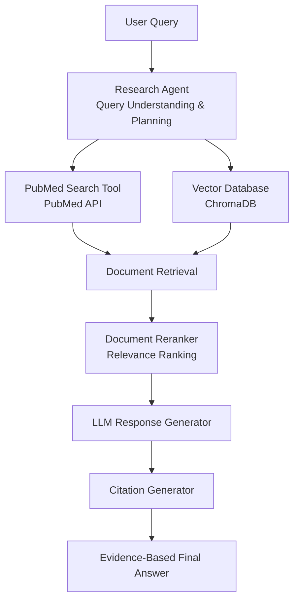

# My LAB

https://connie-lab.streamlit.app/

This repository contains several AI application demos demonstrating practical implementations of LLMs, RAG, Computer vision, and OCR Technologies. 
The projects focus on building end-to-end AI applications, inclusing data processing, model integration, and interactive user interface. 

# Projects

## 1. Biomedical research agent with RAG System
### Overview
This project implements an AI-powered biomedical research assiatant using a RAG system. 
The system helps users efficiently analyze biomedical literature by retrieving relevant research papers from PubMed and generating evidence-based summaries with references. 

### Workflow

## 2. OCR Text Extraction
### Overview
This project extracts text information from recipt images using Optical Character Recognition (OCR).
The system processes uploaded recipt images and converts visual text into structured digital text. 

### Key Features
- Receipt image preprocessing
- Text extraction from images
- OCR-based document understanding
- Conversion of unstructured images into machine-readable text

## 3. Vision-Language Image Captioning with BLIP
### Overview
This project demonstrates an image captioning application using the BLIP(Bootstrapping Language-Image Pre-training) model. 
Users can upload an image, and the model analyzes visual information to automatically generate a natural language description of the image. 
This project showcases a practical application of vision-language models by combining computer vision and natual language generation. 

